本文将引导大家快速的入门 [Form Flow](https://github.com/vran-dev/obsidian-form-flow) 插件的安装和使用

我们会晚餐一个用于记录 `时间日志` 的表单，它的作用是快速将我们输入的内容以无序列表的形式自动保存到日记的 `## 日志` 标题下，每个无序列表前会自动添加记录时的时间，就像下面这样

```markdown

## 日志

- 09:30 今天的天气真不错
- 10:30 喝了一杯咖啡，开始干活儿！

```


## 一、安装插件

> 插件目前尚在上架审核中，无法在插件市场搜到，需要手动下载安装

1. 前往 [Github Release](https://github.com/vran-dev/obsidian-form-flow/releases) 下载最新版本的插件文件，包含 `main.js`，`styles.css`， `manifest.json` 三个文件
2. 在 `{你的库目录}/.obsidian/plugins` 下创建一个 `form-flow` 文件夹
3. 将第一步下载的 3 个文件放到该文件夹下
4. 回到 obsidian 中，在 `设置→第三方插件` 中刷新插件列表，然后启用 `form-flow` 插件即可

## 二、创建表单

插件安装好以后，我们可以按下 ctrl+p （mac 是 command+p）打开命令面板，输入 `form` 关键词，选择并执行 `form flow: 创建表单` 的命令。

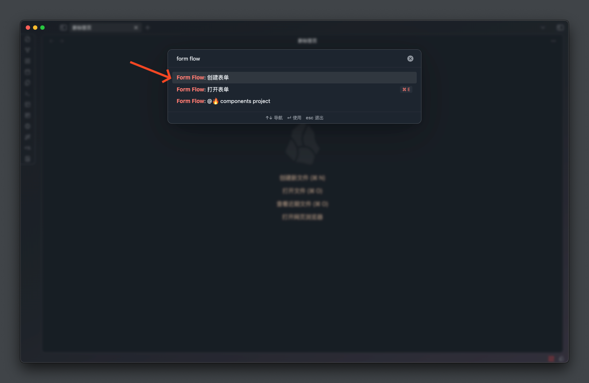

接着你会看到一个输入框，要求你输入一个「文件名」，这其实就是表单的名字。

> 一个表单就是一个文件

我们在输入框中 `时间日志` 然后按下回车，

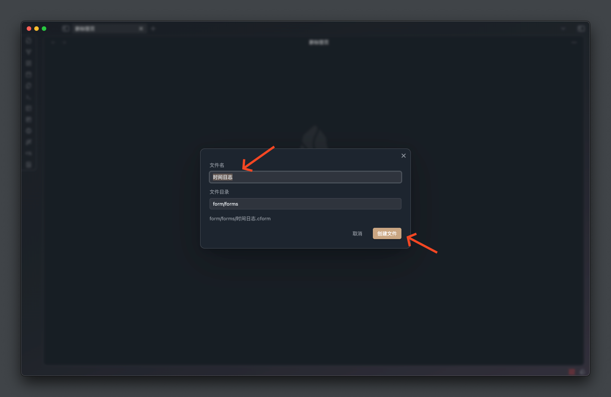

创建成功后插件会自动打开该表单文件，我们点击右上方的齿轮图标就可以进入到表单的设置页面

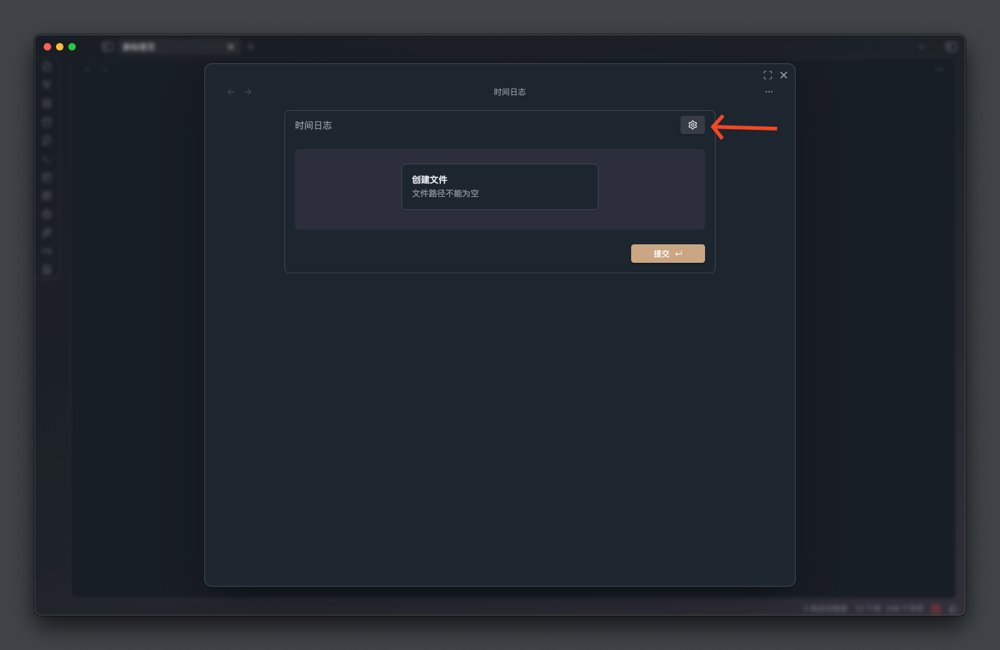


## 配置表单

配置表单实际上就是在配置字段和执行动作

- 表单字段： 字段定义了我们要收集的内容，可以是文本框、下拉列表、复选框等。
- 执行动作:  动作是提交表单后触发的行为，比如创建文件、更新属性等。

### 配置字段

在表单的配置页面我们可以点击「+添加字段」来添加字段

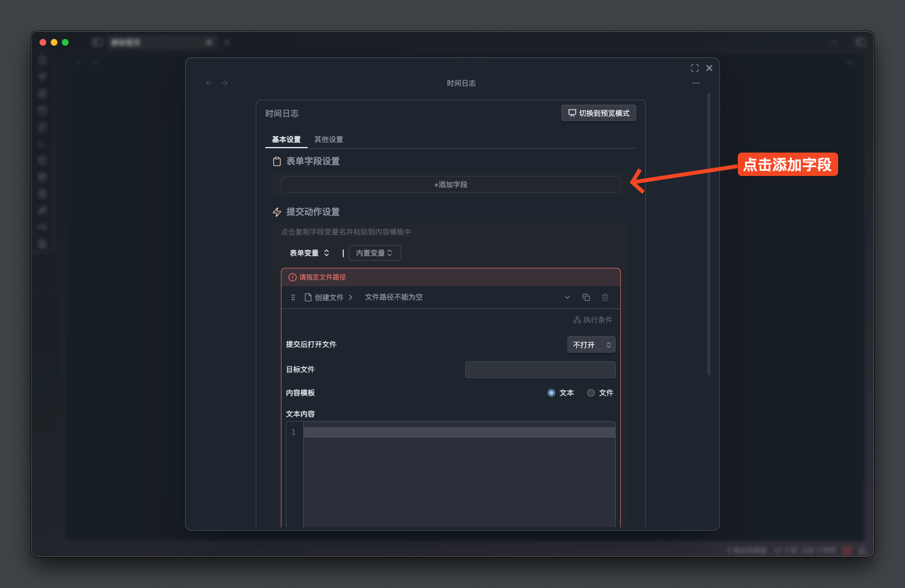

默认添加的是一个单行文本类型字段，其他类型可以展开菜单查看，不同的类型决定了字段的展现形式。

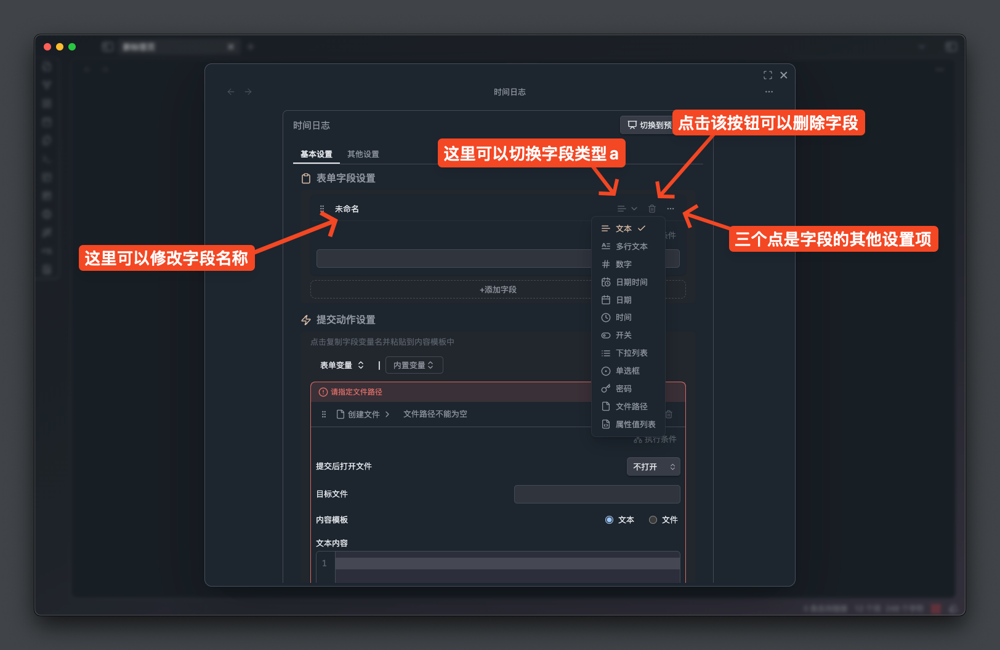

点击名称处，先把字段名改为 `想法` 

> 字段名的命名很重要，我们后续在执行动作里需要根据名称来引用字段

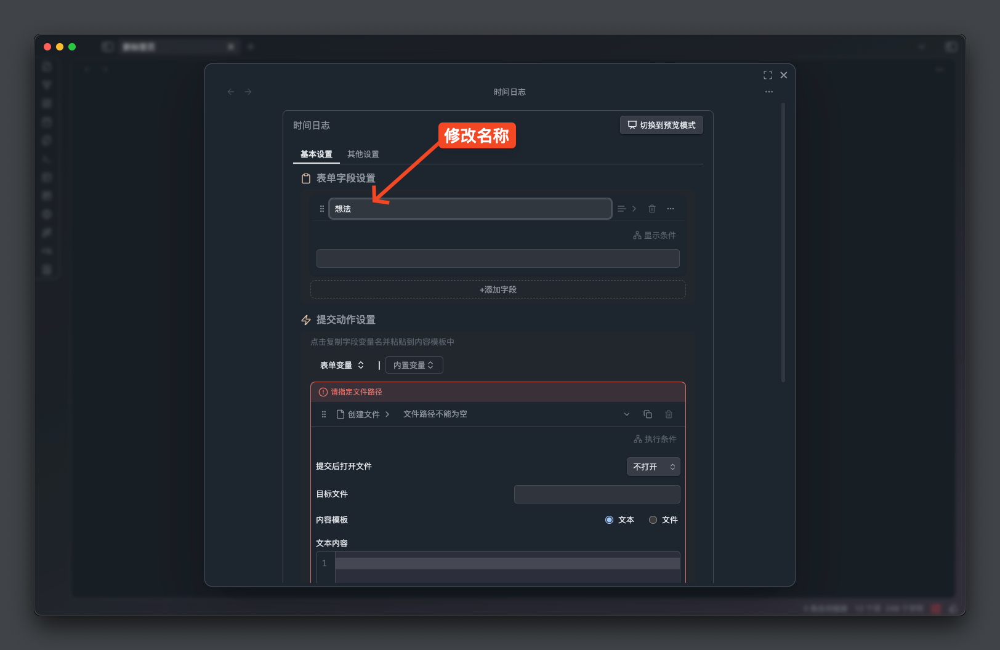

### 配置执行动作

表单创建的时候会默认创建一个「创建文件」的执行动作，本次教程我们是用不到的，将其切换为 「插入文本」的执行动作

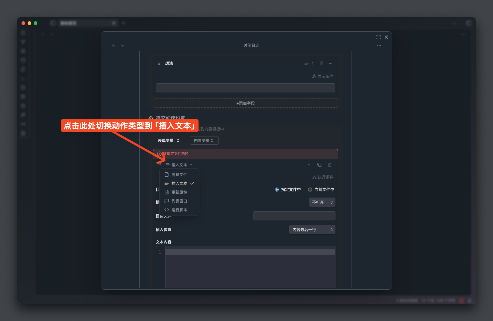


由于我们要将内容存入日记的 `## 日志` 标题中，所以配置的时候要注意文件路径要匹配你的日记目录和文件名格式，配置如下

- 目标文件： `指定文件中`
- 提交后打开文件： `不打开`
- 目标文件： `日记/{{date: YYYY-MM-DD}}.md`
- 插入位置： `指定标题下最后一行`
	- 标题： `## 日志`
- 文本内容: `- {{time}} {{@想法}}`

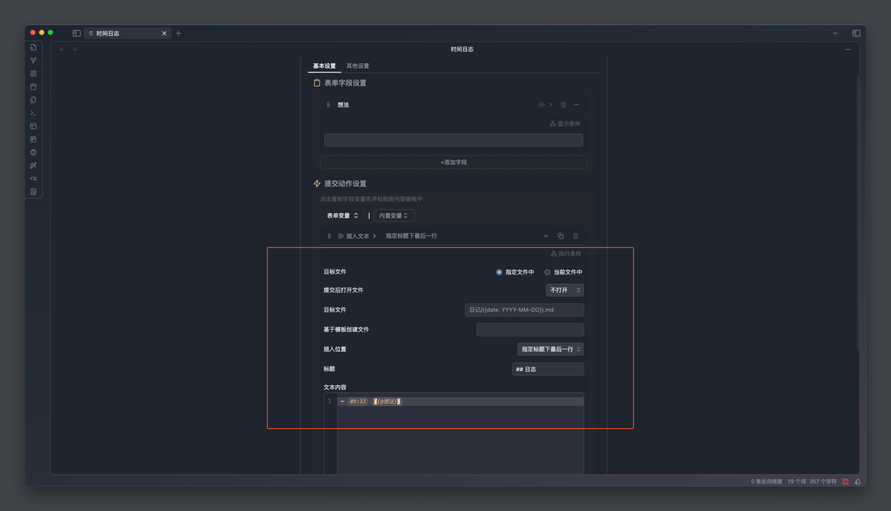

我们使用到了一些模板语法，简单解释一下 

- `{{date: YYYY-MM-DD}}` 会在提交表单时候替换成当天的日期，比如 `2025-01-01`
- `{{time}}` 会在表单提交的时候替换成当时的时间，比如 `12:00`
- `{{@想法}}` 会在表单提交的时候替换成字段的实际输入值
- `## 日志` 是 markdown 的二级标题语法

到这儿我们的表单就配置完成了，接下来就可以享受表单带来的魔法了
## 使用表单

我们在 obsidian 中按下 ctrl+p（MAC 是 command+p） 打开命令面板，输入 `form` 搜索执行 `form flow: 打开表单` 命令，执行后会打开一个表单列表。

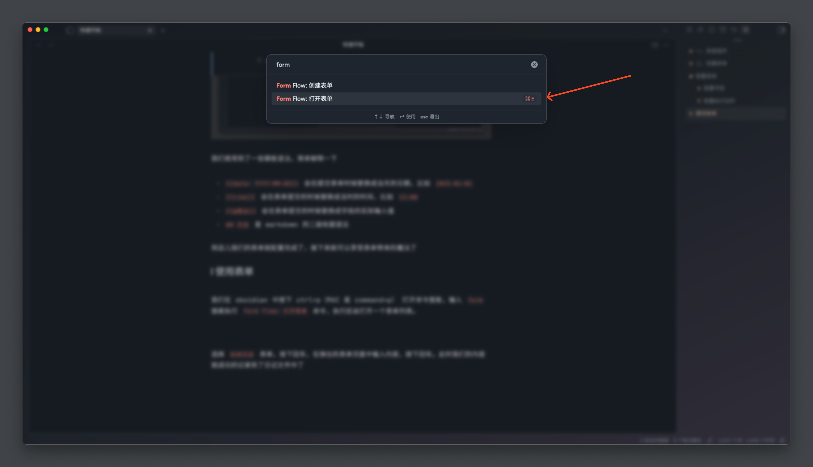


在列表中选择 `时间日志` 表单，按下回车

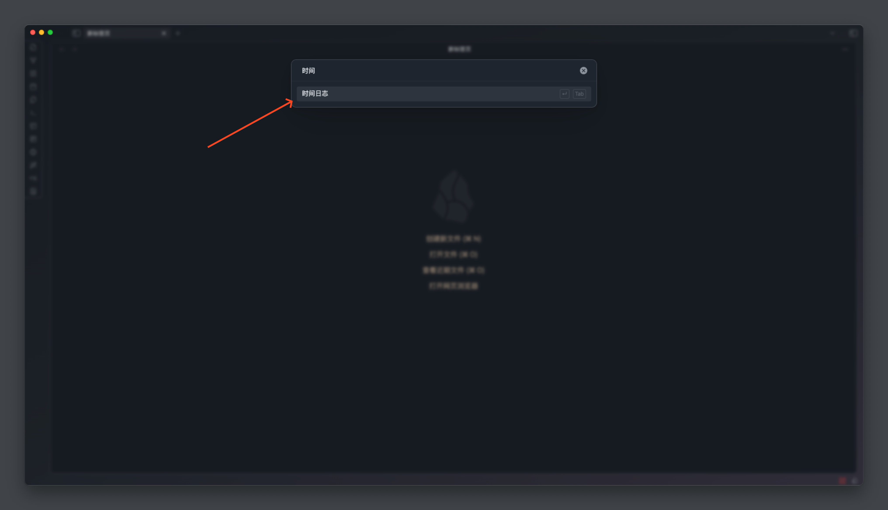

在弹出的表单页面中输入内容，按下回车。此时我们的内容就成功的记录到了日记文件中了

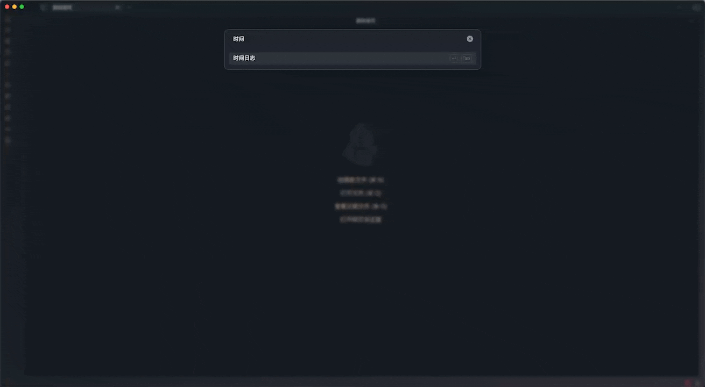

为了更加快捷，你可以在 obsidian 的 `设置/快捷键` 将 `form flow: 打开表单` 的命令设置为一个快捷键。

