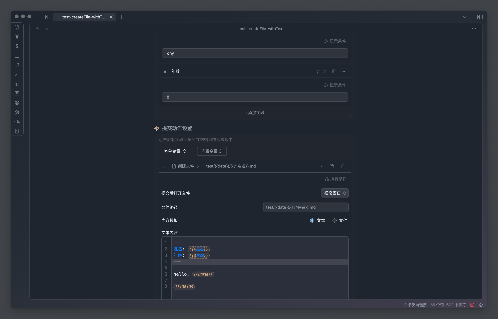

「创建文件」是一个简单但是非常是用的提交动作，通常用于创建一个带默认内容格式的文件。

可以用来快捷的创建日记、项目文档、会议记录等。

## 配置项说明

### 提交后打开文件

决定了动作执行完成以后是否在指定的位置打开新创建的页面，默认是不打开

### 文件路径

要创建的文件的完整路径（相对于当前 obsidian 库），比如 `日记/{{date:YYYY-MM-DD}}.md` 表示在日记目录下创建一个日记文件。

除了 `md` 以外，我们也可以指定其他类型的文件，比如 `canvas`

### 内容模板

内容模板有两种，分别是「文本」和「文件」。

- 文本的话，就是直接在表单中输入内容，表单会自动将这些内容写入到文件中去。
- 文件的话，就是引用一个笔记文件作为模板，表单会将模板中的内容写入到新文件中去

在内容中我们可以使用 `{{@表单字段名}}` 来引用实际的字段输入值。

比如有一个 `想法` 的文本输入框，在文本内容中通过 `{{@想法}}` 表示用户输入的实际值，插件会自动将这个变量替换成用户的输入。

> 你也可以试用 `{{date}}` 等内置变量，详情查看内置变量一节

