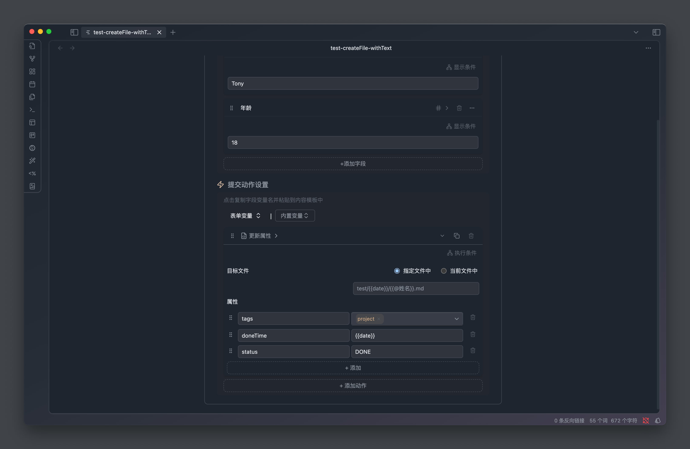

「更新属性」可以一次性更新指定文件中的多个属性值，比如你可以构建一个「✅完成项目」的表单，执行以后

- 将项目状态更新为「已完成」
- 将项目完成时间更新为当前时间

也可以用做笔记的属性模板插入功能，为一个空白的笔记添加指定的所有属性（更新属性时，如果属性不存在会自动创建）

## 配置项说明

### 目标文件

与「插入文本」动作类似，指出两种类型

- 指定文件中： 写入内容到指定的具体的文件里，需要用户配置一个完整的文件路径
- 当前文件中： 写入内容到当前激活的笔记文件里

### 属性

这里配置需要更新的属性名称和属性值，可以配置多个。

属性名和属性值都可以引用表单字段变量和内置变量

